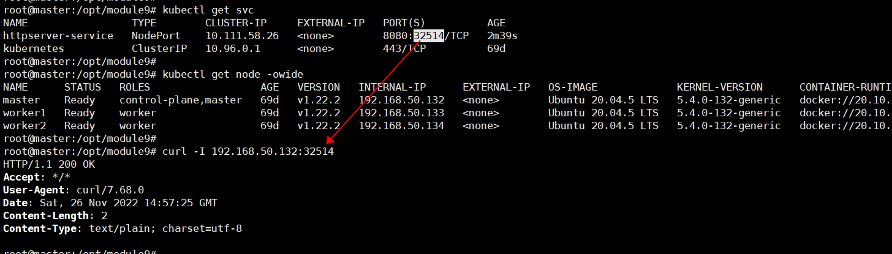
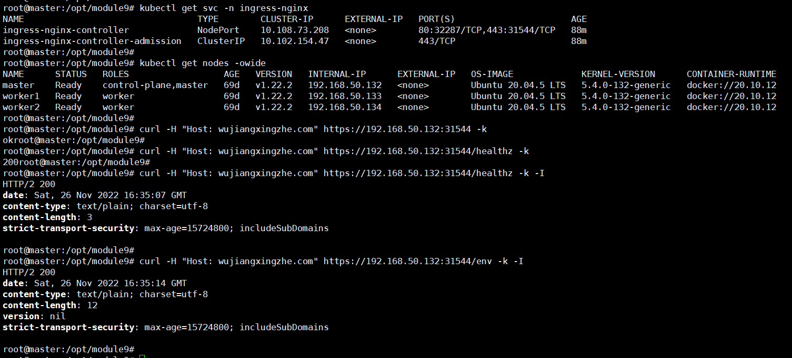

# httpserver

## 1. Service
> Create Pod
```
root@master:/opt/module9# kubectl create -f httpserver-deployment.yaml 
deployment.apps/httpserver-deployment created
root@master:/opt/module9# 
root@master:/opt/module9# kubectl get po
NAME                                     READY   STATUS    RESTARTS   AGE
httpserver-deployment-7798f9cdfb-cxj9x   0/1     Running   0          7s
httpserver-deployment-7798f9cdfb-vfc5f   0/1     Running   0          7s
```

> Create Service
```
root@master:/opt/module9# kubectl create -f httpserver-service.yaml 
service/httpserver-service created
root@master:/opt/module9# 
root@master:/opt/module9# kubectl get svc
NAME                 TYPE        CLUSTER-IP     EXTERNAL-IP   PORT(S)          AGE
httpserver-service   NodePort    10.111.58.26   <none>        8080:32514/TCP   6s
kubernetes           ClusterIP   10.96.0.1      <none>        443/TCP          69d
```

> Test Service




## 2. Ingress
> Create Ingress Controller
```
root@master:/opt/module9# kubectl create -f nginx-ingress-deployment.yaml 
namespace/ingress-nginx created
serviceaccount/ingress-nginx created
configmap/ingress-nginx-controller created
clusterrole.rbac.authorization.k8s.io/ingress-nginx created
clusterrolebinding.rbac.authorization.k8s.io/ingress-nginx created
role.rbac.authorization.k8s.io/ingress-nginx created
rolebinding.rbac.authorization.k8s.io/ingress-nginx created
service/ingress-nginx-controller-admission created
service/ingress-nginx-controller created
deployment.apps/ingress-nginx-controller created
ingressclass.networking.k8s.io/nginx created
validatingwebhookconfiguration.admissionregistration.k8s.io/ingress-nginx-admission created
serviceaccount/ingress-nginx-admission created
clusterrole.rbac.authorization.k8s.io/ingress-nginx-admission created
clusterrolebinding.rbac.authorization.k8s.io/ingress-nginx-admission created
role.rbac.authorization.k8s.io/ingress-nginx-admission created
rolebinding.rbac.authorization.k8s.io/ingress-nginx-admission created
job.batch/ingress-nginx-admission-create created
job.batch/ingress-nginx-admission-patch created
```

> Generate tls.key/tls.crt
```
root@master:/opt/module9# openssl req -x509 -nodes -days 365 -newkey rsa:2048 -keyout tls.key -out tls.crt -subj "/CN=wujiangxingzhe.com/O=wujiangxingzhe" -addext "subjectAltName = DNS:wujiangxingzhe.com"
Generating a RSA private key
..........................................................+++++
......................+++++
writing new private key to 'tls.key'
-----
root@master:/opt/module9# ls -l tls.*
-rw-r--r-- 1 root root 1249 Nov 26 15:09 tls.crt
-rw------- 1 root root 1708 Nov 26 15:09 tls.key
```

> Create secret ConfigMap for tls.key/tls.crt
```
root@master:/opt/module9# kubectl create secret tls wujiangxingzhe-tls --key=tls.key --cert=tls.crt 
secret/wujiangxingzhe-tls created
root@master:/opt/module9# 
root@master:/opt/module9# kubectl get secrets 
NAME                  TYPE                                  DATA   AGE
default-token-vmn7r   kubernetes.io/service-account-token   3      69d
wujiangxingzhe-tls    kubernetes.io/tls                     2      8s
```

> Create Ingress
```
root@master:/opt/module9# kubectl create -f httpserver-ingress.yaml 
ingress.networking.k8s.io/httpserver-ingress created
root@master:/opt/module9# 
root@master:/opt/module9# kubectl get ing
NAME                 CLASS   HOSTS                ADDRESS          PORTS     AGE
httpserver-ingress   nginx   wujiangxingzhe.com   192.168.50.133   80, 443   5s
```

> Test Ingress



